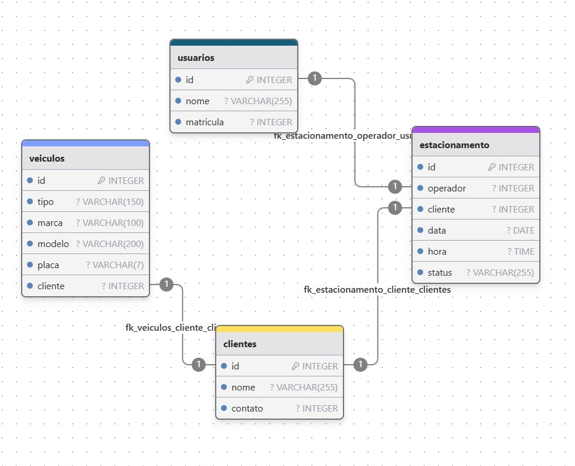

# Projeto de Banco de Dados - Estacionamento

> ℹ️ **NOTE:** Projeto final do curso curso de Desenvolvimento de Banco de Dados para plataforma [RioOn](https://rioon.rio.br/) em parceria com o [Senac RJ](https://www.rj.senac.br/).

    Diagrama MER

 
## 📄 Requisitos do Banco de Dados

|   **Requisitos** |
| ------------------------------------------------------------------------------------------------------------------------------------------------------------------------------------------------------------------------------------------------------------------------------ |
| <li> Os usuários terão o seu nome e matrícula </li> |
 | <li> Os clientes terão o nome e contato </li>|
 | <li> Os veículos terão  o tipo(se é carro ou moto), marca, modelo, placa e qual cliente é o seu proprietário </li>|
 | <li> O estacionamento identificará que é os operadores; os clientes; os veículos; data e hora de entrada dos veículos no estacionamento (referenciar pelo proprietário, ou seja, o cliente); e o status que informará se os veículos estão ou não estacionados nas vagas do estacionamento </li>|
 | <li> Todas as tabelas tem chave primária </li>|

## 📄 Principais objetivos do projeto

|   Ação   | Objetivo                                                                                                                                                                                                                                                                         |
| :------: | ------------------------------------------------------------------------------------------------------------------------------------------------------------------------------------------------------------------------------------------------------------------------------ |
|  Criação do Diagrama do MER |  Feito no DrawDB, cumprindo os requisitos listados |
|  Criação do Banco de Dados  | Desenvolver um sistema de Banco de Dados para um sistema de estacionamento que tem o operador do sistema, os clientes, veículos desses clientes (donos(as)) e o estacionamento (local que vai centralizar as informações). |
| Criação das Tabelas | Criar as tabelas de funcionamento do Banco de Dados: Usuário, Clientes, Veículos e Estacionamento respeitando as chaves primárias e estrangeiras|
| Inserção de Dados | Inserir os dados passados no arquivo em Excel, através de código sql |
| Criação das Tabelas | Criar as tabelas de funcionamento do Banco de Dados: Usuário, Clientes, Veículos e Estacionamento |
| Consultas e Updates | Realizar consultas e updates no banco de dados |

## 💻 Tecnologias utilizadas no projeto

- [DrawDB](https://chat.openai.com/) 
- [MySQLServer](https://www.mysql.com/)

## ✨ Como foi feito ?

- Diagrama MER realizado no DrawDB
- Banco de dados foi desenvolvido dentro do MySQLServer
- Linguagem utilizada: **SQL**
- Todas as consultas estão comentadas dentro do arquivo

